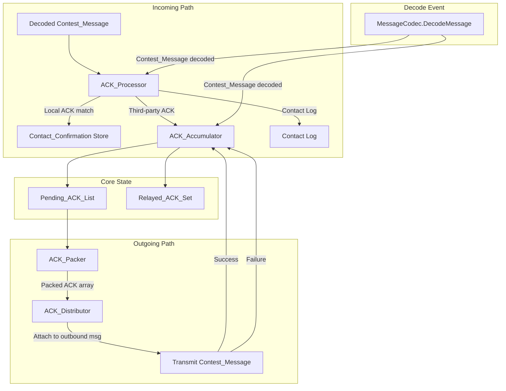
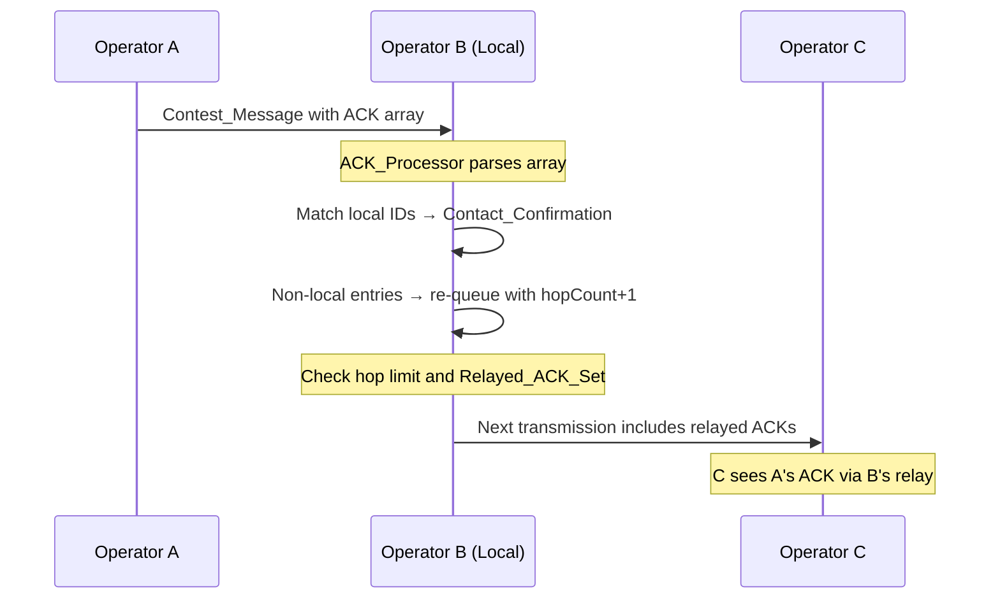

# Design Document: Operator ACK Accumulation

## Overview

This design implements the operator ACK accumulation and distribution system for Ribbit's Contest Mode (Type 2). The system enables automatic acknowledgement of decoded transmissions, packing ACK entries into outbound messages, distributing them via normal data packets, and processing received ACK arrays to confirm two-way contacts.

The architecture introduces four cooperating components — ACK_Accumulator, ACK_Packer, ACK_Distributor, and ACK_Processor — layered on top of the existing `MessageCodec` encode/decode pipeline in `web/scripts/messageCodec.js` and the WASM C++ encoder in `src/ribbit/include/message_format.hh`.

**Key Design Decisions:**
- Pure JavaScript implementation in `web/scripts/` (no WASM changes needed for ACK logic)
- ACK entries use an 84-bit wire format: Message_ID[80] + HopCount[4], enabling gossip relay
- Maximum 22 entries per message: floor((1920 - 8) / 84) = 22
- Priority ordering uses a stable sort with three-tier precedence
- Slot-based timing (2-second UTC grid) aligns with Ribbit's existing transmission cycle

## Architecture



### Component Interaction Flow

1. **Decode event**: When `DecodeMessage()` yields a Contest_Message, both `ACK_Accumulator` and `ACK_Processor` are invoked.
2. **Accumulation**: `ACK_Accumulator` extracts the sender's Message_ID and appends it to `Pending_ACK_List` (if not duplicate, not self, not at capacity).
3. **Processing**: `ACK_Processor` parses the incoming ACK array. Entries matching local transmitted Message_IDs create `Contact_Confirmation`s. Non-matching entries are re-queued as relays (with hop count incremented).
4. **Packing**: Before transmission, `ACK_Packer` snapshots `Pending_ACK_List`, applies priority sort, selects up to 22 entries, and serializes to the 84-bit wire format.
5. **Distribution**: `ACK_Distributor` attaches the packed ACK array to the outbound Contest_Message and manages post-transmission cleanup (remove on success, retain on failure).

## Components and Interfaces

### ACK_Accumulator

**File:** `web/scripts/ackAccumulator.js`

**Responsibilities:**
- Maintain the `Pending_ACK_List` (ordered collection of ACK entries)
- Deduplicate incoming Message_IDs
- Filter self-originated messages
- Enforce capacity limit (50 entries)
- Expire stale entries based on slot age
- Maintain `Relayed_ACK_Set` for relay deduplication

```javascript
class ACKAccumulator {
    constructor(config = {}) { }

    // Add a decoded message's ID to the pending list
    // Returns true if added, false if filtered (duplicate, self, capacity eviction)
    addFromDecode(messageId, senderCallsign, currentSlot) → boolean

    // Add a third-party relay entry (from ACK_Processor)
    addRelay(messageId, hopCount, currentSlot) → boolean

    // Snapshot and remove entries for packing (called by ACK_Packer)
    takeForPacking(maxEntries) → ACKEntry[]

    // Return entries to list on transmission failure
    returnEntries(entries) → void

    // Confirm successful transmission (add to Relayed_ACK_Set)
    confirmTransmission(entries) → void

    // Remove expired entries (called periodically on slot tick)
    expireEntries(currentSlot) → ExpiredEntry[]

    // Mark entries as in-flight (prevents expiration)
    markInFlight(entries) → void

    // Unmark in-flight status
    unmarkInFlight(entries) → void

    // Getters
    get pendingCount() → number
    get relayedSetSize() → number
}
```

### ACK_Packer

**File:** `web/scripts/ackPacker.js`

**Responsibilities:**
- Serialize ACK entries to the 84-bit wire format
- Deserialize received ACK arrays from bitstream
- Apply priority ordering before packing
- Produce count field + entry blocks

```javascript
class ACKPacker {
    constructor(accumulator, config = {}) { }

    // Pack pending entries into wire format bitstream
    // Returns { bitstream: string, packedEntries: ACKEntry[], count: number }
    pack(contactConfirmations) → PackResult

    // Unpack ACK array from received bitstream
    // Returns { entries: ACKEntry[], count: number } or { entries: [], count: 0 } on error
    static unpack(bitstream) → UnpackResult

    // Encode a single ACK entry to 84-bit block
    static encodeEntry(entry) → string  // 84-bit bitstream

    // Decode a single 84-bit block to ACK entry
    static decodeEntry(bits) → ACKEntry

    // Calculate available capacity
    static get MAX_ENTRIES() → 22
    static get ENTRY_BITS() → 84
    static get COUNT_BITS() → 8
    static get MAX_ACK_FIELD_BITS() → 1920
}
```

### ACK_Distributor

**File:** `web/scripts/ackDistributor.js`

**Responsibilities:**
- Integrate packed ACK array into outbound Contest_Messages
- Manage in-flight state tracking
- Handle transmission success/failure callbacks

```javascript
class ACKDistributor {
    constructor(accumulator, packer, config = {}) { }

    // Prepare ACK payload for the next outbound message
    // Called at message encoding time (snapshot moment)
    preparePayload(contactConfirmations) → { bitstream: string, inFlightEntries: ACKEntry[] }

    // Called when transmission completes successfully
    onTransmitSuccess() → void

    // Called when transmission is interrupted
    onTransmitFailure() → void

    // Whether there are entries in-flight
    get isInFlight() → boolean
}
```

### ACK_Processor

**File:** `web/scripts/ackProcessor.js`

**Responsibilities:**
- Parse received ACK arrays
- Match entries against local transmitted Message_IDs
- Create Contact_Confirmations
- Re-queue third-party entries for relay
- Maintain contact log

```javascript
class ACKProcessor {
    constructor(accumulator, config = {}) { }

    // Process a decoded Contest_Message's ACK array
    // Returns { confirmations: ContactConfirmation[], relayed: number, discarded: number }
    processIncoming(senderCallsign, ackBitstream, localTransmittedIds) → ProcessResult

    // Query contact log
    getContactLog() → ContactLogEntry[]

    // Query confirmations for a specific Message_ID
    getConfirmationsFor(messageId) → ContactConfirmation[]

    // Check if contact is confirmed with a specific operator
    isConfirmed(operatorCallsign, messageId) → boolean
}
```

## Data Models

### ACKEntry

```javascript
{
    messageId: string,       // 80-bit Message_ID as hex string (20 chars)
    callsign: string,        // Decoded callsign (from Message_ID, max 8 chars)
    timestamp: number,       // Decoded 31-bit timestamp value
    emergency: boolean,      // Emergency flag from Message_ID
    hopCount: number,        // 0 = first-hand, 1-7 = relayed (4-bit, max 15)
    addedAtSlot: number,     // Slot index when added to Pending_ACK_List
    transmitAttempts: number, // Number of times included in a transmission
    isInFlight: boolean      // Currently in an in-flight transmission
}
```

### ContactConfirmation

```javascript
{
    messageId: string,              // The local Message_ID that was acknowledged
    acknowledgerCallsign: string,   // Callsign of the operator who sent the ACK
    confirmedAtSlot: number,        // Slot when confirmation was received
    confirmedAtUTC: Date            // UTC timestamp of confirmation
}
```

### ContactLogEntry

```javascript
{
    messageId: string,          // The 80-bit Message_ID (hex)
    relayerCallsign: string,    // Callsign of the operator who relayed this ACK
    receivedAtUTC: Date,        // UTC timestamp of reception (1-second precision)
    hopCount: number            // Hop count at time of reception
}
```

### Configuration

```javascript
const DEFAULT_CONFIG = {
    maxPendingEntries: 50,       // Max entries in Pending_ACK_List
    maxEntriesPerMessage: 22,    // floor((1920 - 8) / 84)
    expirationSlots: 60,         // 120 seconds at 2s/slot
    minExpirationSlots: 5,       // 10 seconds minimum
    maxExpirationSlots: 300,     // 600 seconds maximum
    maxHopCount: 3,              // Max relay hops (range 1-7)
    localCallsign: '',           // Set at initialization
    entryBits: 84,              // Per-entry wire size
    countBits: 8                // Count field size
};
```

## Wire Format

### ACK Array Field Layout (within Contest_Message)

```
┌─────────────────────────────────────────────────────────────────┐
│                    ACK Array Field (0–1920 bits)                 │
├────────────┬─────────────────────────────────────┬──────────────┤
│ Count [8b] │ Entry[0..N-1] × 84 bits each        │ Zero-pad     │
└────────────┴─────────────────────────────────────┴──────────────┘
```

- **Count field**: 8-bit unsigned integer (0–22 valid range for packing, 0–255 for parsing tolerance)
- **Maximum payload**: 8 + (22 × 84) = 1856 bits (within the 1920-bit ACK Array field)
- **Zero-padding**: Remaining bits after the last entry are zero-padded to byte boundary

### Single ACK Entry (84 bits)

```
┌────────────────────────────────────────────────────────────────────────────────────┐
│                           ACK Entry (84 bits)                                       │
├──────────────────────────┬───────────────────┬─────────────┬───────────────────────┤
│   Callsign [48 bits]     │  Timestamp [31b]  │ Emergency   │  HopCount [4 bits]    │
│   6-bit alphanum × 8     │  composite        │  [1 bit]    │  unsigned 0–15        │
└──────────────────────────┴───────────────────┴─────────────┴───────────────────────┘

Bit positions within entry:
  [0..47]  — Callsign (8 chars × 6 bits, right-padded with space=63 if <8 chars)
  [48..78] — Timestamp (31-bit composite: months[10] + day[5] + hour[5] + min[6] + sec[5])
  [79]     — Emergency flag (1 bit)
  [80..83] — Hop count (4-bit unsigned integer, 0 = first-hand, max 15)
```

**Note:** The first 80 bits of each entry are the standard Ribbit Message_ID (Callsign[48] + Timestamp[31] + Emergency[1]). The 4-bit hop count is appended, making each ACK entry 84 bits total. This differs from the requirements document's reference to 80-bit entries — the hop count field (Requirement 8.2) adds 4 bits per entry.

### Encoding Rules

- **Callsign**: 6-bit alphanum encoding per `ALPHANUMBIT_ENCODE` in `message_format.hh`. Callsigns shorter than 8 characters are right-padded with the space character (value 63).
- **Timestamp**: 31-bit composite format matching `GetTimestampBitStream()` in `messageCodec.js`.
- **Emergency**: Single bit (1 = emergency, 0 = normal).
- **Hop count**: 4-bit unsigned integer. 0 indicates first-hand ACK (decoded directly). Values 1+ indicate relay hops. Maximum configurable limit defaults to 3 (entries at or above the limit are not re-queued for relay).

### Capacity Calculation

```
ACK Array field capacity: 1920 bits
Count field overhead:       8 bits
Available for entries:   1912 bits
Entry size:                84 bits
Max entries: floor(1912 / 84) = 22
Actual usage: 8 + (22 × 84) = 1856 bits (64 bits unused/zero-padded)
```

## Packing Algorithm with Priority Ordering

### Priority Sort Algorithm

When `Pending_ACK_List` has more entries than can fit (>22), the packer applies a stable multi-criteria sort:

```
Priority Tiers (highest to lowest):
  Tier 1: First-hand (hopCount=0), first-time (transmitAttempts=0), unconfirmed contact
  Tier 2: First-hand (hopCount=0), first-time (transmitAttempts=0), confirmed contact
  Tier 3: First-hand (hopCount=0), retransmission (transmitAttempts>0), unconfirmed contact
  Tier 4: First-hand (hopCount=0), retransmission (transmitAttempts>0), confirmed contact
  Tier 5: Relayed (hopCount>0), first-time, unconfirmed contact
  Tier 6: Relayed (hopCount>0), first-time, confirmed contact
  Tier 7: Relayed (hopCount>0), retransmission, unconfirmed contact
  Tier 8: Relayed (hopCount>0), retransmission, confirmed contact

Within each tier: FIFO (earlier addedAtSlot first)
Final tiebreaker: earlier addedAtSlot (same as FIFO)
```

### Priority Sort Comparator (pseudocode)

```javascript
function compareACKPriority(a, b, confirmations) {
    // 1. First-hand vs relayed (hopCount 0 beats hopCount > 0)
    const aFirstHand = a.hopCount === 0;
    const bFirstHand = b.hopCount === 0;
    if (aFirstHand !== bFirstHand) return aFirstHand ? -1 : 1;

    // 2. First-time vs retransmission
    const aFirstTime = a.transmitAttempts === 0;
    const bFirstTime = b.transmitAttempts === 0;
    if (aFirstTime !== bFirstTime) return aFirstTime ? -1 : 1;

    // 3. Unconfirmed vs confirmed contact
    const aConfirmed = confirmations.has(a.callsign);
    const bConfirmed = confirmations.has(b.callsign);
    if (aConfirmed !== bConfirmed) return aConfirmed ? 1 : -1;

    // 4. FIFO tiebreaker (earlier addedAtSlot wins)
    return a.addedAtSlot - b.addedAtSlot;
}
```

### Packing Procedure

1. Snapshot `Pending_ACK_List` at encoding time
2. Sort snapshot by priority (stable sort preserves insertion order for ties)
3. Select top min(22, snapshot.length) entries
4. Mark selected entries as in-flight
5. Encode: 8-bit count + (N × 84-bit entry blocks) + zero-pad to byte boundary
6. Return packed bitstream and in-flight entry references

## Relay/Gossip Algorithm with Hop Count

### Relay Flow



### Relay Rules

1. **Hop increment**: When re-queuing a third-party ACK, set `hopCount = incomingHopCount + 1`
2. **Hop limit check**: If `hopCount >= maxHopCount` (default 3), do not re-queue
3. **Deduplication**: Check both `Pending_ACK_List` (by Message_ID) and `Relayed_ACK_Set`
4. **Relayed_ACK_Set update**: On successful transmission, add relayed Message_IDs to the set
5. **Set expiration**: `Relayed_ACK_Set` entries expire after the same interval as `Pending_ACK_List` entries (default 120 seconds / 60 slots)

### Priority Demotion

Relayed entries (hopCount > 0) are always lower priority than first-hand entries (hopCount = 0). This ensures an operator's own acknowledgements always take precedence over gossip relays.

## Integration with Existing Encode/Decode Paths

### Encoding Integration

The ACK array is appended after the message content in `MessageCodec.EncodeMessage()`:

```javascript
// In messageCodec.js EncodeMessage() — after message bits:
EncodeMessage(data) {
    // ... existing header + variable fields ...
    let bitstream = /* existing encoding */;

    // NEW: Append ACK array if Contest Mode and ackPayload provided
    if (data.messageType === 2 && data.ackPayload) {
        bitstream += data.ackPayload;  // Pre-packed by ACK_Packer
    }

    return bitstream;
}
```

### Decoding Integration

The ACK array is extracted from the tail of the bitstream in `MessageCodec.DecodeMessage()`:

```javascript
// In messageCodec.js DecodeMessage() — after message content:
DecodeMessage(bitstream) {
    // ... existing field extraction ...
    offset += messageBitLength;

    // NEW: Extract ACK array for Contest Mode messages
    let ackArray = { entries: [], count: 0 };
    if (messageType === 2 && offset < bitstream.length) {
        const ackBitstream = bitstream.slice(offset);
        ackArray = ACKPacker.unpack(ackBitstream);
    }

    return {
        // ... existing fields ...
        ackArray: ackArray
    };
}
```

### Application-Level Integration

In `web/scripts/index.js` (or a new orchestrator module):

```javascript
// On message decode event:
async handleWasmDecodedMessage(payloadPtr) {
    const decoded = codec.DecodeMessage(bitstream);

    if (decoded.messageType === 2) {
        // 1. Accumulate sender's Message_ID
        ackAccumulator.addFromDecode(decoded.messageId, decoded.callsign, currentSlot);

        // 2. Process incoming ACK array
        ackProcessor.processIncoming(
            decoded.callsign,
            decoded.ackArray,
            localTransmittedIds
        );
    }
}

// On message encode (before transmission):
async handleEncode() {
    // ... existing encode logic ...
    if (messageType === 2) {
        const { bitstream: ackPayload, inFlightEntries } =
            ackDistributor.preparePayload(contactConfirmations);
        data.ackPayload = ackPayload;
    }
    // ... encode and transmit ...
}
```

## Expiration Mechanism

### Slot-Based Timing

Ribbit operates on a 2-second UTC grid (slots). Expiration is measured in slot ticks:

- Default expiration: 60 slots (120 seconds)
- Configurable range: 5–300 slots (10–600 seconds)
- Check frequency: Every slot tick (2 seconds)

### Expiration Logic

```javascript
expireEntries(currentSlot) {
    const expired = [];
    for (const entry of this.pendingList) {
        if (entry.isInFlight) continue;  // Protected while in-flight
        const age = currentSlot - entry.addedAtSlot;
        if (age >= this.config.expirationSlots) {
            expired.push(entry);
            this.log(`ACK expired: ${entry.messageId} age=${age} slots`);
        }
    }
    // Remove expired from list
    this.pendingList = this.pendingList.filter(e => !expired.includes(e));

    // Also expire Relayed_ACK_Set entries
    this.expireRelayedSet(currentSlot);

    return expired;
}
```

### In-Flight Protection

Entries that are part of an in-flight transmission are immune to expiration. If the transmission fails, they return to the list with their **original age preserved** — they are not rejuvenated. This means a very old entry that fails to transmit may expire on the next tick after being returned.

## Correctness Properties

*A property is a characteristic or behavior that should hold true across all valid executions of a system — essentially, a formal statement about what the system should do. Properties serve as the bridge between human-readable specifications and machine-verifiable correctness guarantees.*

### Property 1: ACK Entry Serialization Round-Trip

*For any* valid ACK entry (callsign of 1–8 alphanum characters, 31-bit timestamp, boolean emergency flag, hop count 0–15), encoding the entry to 84 bits and decoding back SHALL produce an entry with identical callsign, timestamp, emergency, and hop count values.

**Validates: Requirements 2.7, 7.6**

### Property 2: ACK Array Serialization Round-Trip (Order-Preserving)

*For any* list of 0–22 valid ACK entries, packing the list into an ACK array bitstream (8-bit count + N × 84-bit entries) and unpacking SHALL produce the same entries in the same order with all fields matching.

**Validates: Requirements 7.1, 7.6**

### Property 3: Pending List Deduplication Invariant

*For any* sequence of decoded Contest_Messages, the Pending_ACK_List SHALL never contain two entries with the same 80-bit Message_ID. Adding a Message_ID that already exists in the list SHALL not change the list.

**Validates: Requirements 1.3**

### Property 4: Self-Exclusion Invariant

*For any* decoded Contest_Message whose sender callsign matches the local operator's callsign, the ACK_Accumulator SHALL not add an entry to the Pending_ACK_List. The list size SHALL remain unchanged after processing a self-originated message.

**Validates: Requirements 1.5**

### Property 5: Capacity-Bounded Invariant

*For any* sequence of additions to the Pending_ACK_List, the list size SHALL never exceed 50 entries. When the list is at capacity and a new entry is added, the oldest entry (by addedAtSlot) SHALL be evicted and the new entry SHALL be present.

**Validates: Requirements 1.8**

### Property 6: Priority Ordering Stability

*For any* Pending_ACK_List with entries of mixed priority tiers, the packing selection SHALL always include higher-priority entries before lower-priority entries. Specifically: first-hand entries before relayed entries, first-time entries before retransmissions, and unconfirmed-contact entries before confirmed-contact entries (within the same class).

**Validates: Requirements 5.1, 5.2, 5.3, 5.4, 5.5**

### Property 7: Hop Count Relay Termination

*For any* third-party ACK entry with hop count equal to or exceeding the configured maximum hop limit, the ACK_Processor SHALL not re-queue it into the Pending_ACK_List. This guarantees relay propagation terminates within a bounded number of hops.

**Validates: Requirements 8.3**

### Property 8: Transmission Success Removes Exactly Packed Entries

*For any* successful transmission containing N packed ACK entries, exactly those N entries (identified by Message_ID) SHALL be removed from the Pending_ACK_List after transmission. Entries added after the packing snapshot SHALL remain in the list.

**Validates: Requirements 1.6, 3.3, 3.7**

### Property 9: Malformed ACK Array Safety

*For any* ACK array bitstream where count × 84 exceeds the remaining available bits, the ACK_Processor SHALL return zero entries and SHALL not enter an error state. The system SHALL continue processing subsequent messages normally.

**Validates: Requirements 4.7, 7.5**

### Property 10: Contact Confirmation Idempotence

*For any* (operator_callsign, message_id) pair, creating a Contact_Confirmation is idempotent — receiving the same ACK entry multiple times SHALL not create duplicate confirmations. The confirmation set for any pair SHALL contain at most one entry.

**Validates: Requirements 4.5**

## Error Handling

| Error Condition | Handling Strategy |
|---|---|
| ACK array count field implies more bits than available | Discard entire array, return empty list (Req 4.7, 7.5) |
| Callsign contains invalid characters during decode | Replace with '?' characters per existing alphanum decode behavior |
| Pending_ACK_List at capacity (50) | Evict oldest entry, add new entry (Req 1.8) |
| Transmission interrupted (in_flight → false unexpectedly) | Return packed entries to list with original age (Req 3.8, 6.6) |
| Hop count exceeds maximum on received relay | Discard entry silently (Req 8.3) |
| Zero-count ACK array received | No-op, continue processing (Req 4.6, 7.7) |
| Duplicate Message_ID in Pending_ACK_List | Reject addition silently (Req 1.3) |
| Duplicate relay in Relayed_ACK_Set | Reject re-queue silently (Req 8.4) |
| Invalid timestamp in ACK entry | Accept entry as-is (timestamp is opaque ID component) |

All error conditions are handled without throwing exceptions or entering error states. The system logs warnings for diagnostic purposes but continues normal operation.

## Testing Strategy

### Property-Based Testing

**Library:** A lightweight custom PBT runner (consistent with the existing `web/test/contest-queue/pbt.js` infrastructure already in the project).

**Configuration:** Minimum 100 iterations per property test.

Each correctness property above maps to a single property-based test:

| Property | Test File | Generator Strategy |
|---|---|---|
| 1: Entry round-trip | `ackPacker.property.test.js` | Random callsigns (1-8 alphanum), random 31-bit timestamps, random boolean, random 4-bit hop count |
| 2: Array round-trip | `ackPacker.property.test.js` | Lists of 0-22 random valid entries |
| 3: Deduplication | `ackAccumulator.property.test.js` | Random sequences of Message_IDs with deliberate duplicates |
| 4: Self-exclusion | `ackAccumulator.property.test.js` | Random messages where sender = local callsign |
| 5: Capacity bound | `ackAccumulator.property.test.js` | Random sequences of 50+ unique entries |
| 6: Priority ordering | `ackPacker.property.test.js` | Lists with entries spanning all priority tiers |
| 7: Hop termination | `ackProcessor.property.test.js` | Entries at and above hop limit |
| 8: Transmission removal | `ackDistributor.property.test.js` | Simulated pack-transmit-confirm cycles with interleaved additions |
| 9: Malformed safety | `ackProcessor.property.test.js` | Bitstreams with count > available bits |
| 10: Confirmation idempotence | `ackProcessor.property.test.js` | Repeated ACK entries for same (callsign, messageId) |

**Tag format:** `Feature: operator-ack-accumulation, Property {N}: {property_text}`

### Unit Tests (Example-Based)

- Specific encoding examples with known bit patterns
- Edge cases: empty callsign padding, max-length callsigns, zero-count arrays
- Integration test: full encode-decode cycle with ACK array attached to Contest_Message
- Slot timing: verify expiration at exactly the boundary slot
- Transmission lifecycle: success path, failure path, interleaved additions

### Integration Tests

- End-to-end: Encode Contest_Message with ACK array → transmit → decode → verify ACK entries
- Multi-operator simulation: 3 operators exchanging ACKs with relay propagation
- Contact confirmation: Verify two-way handshake completes correctly
