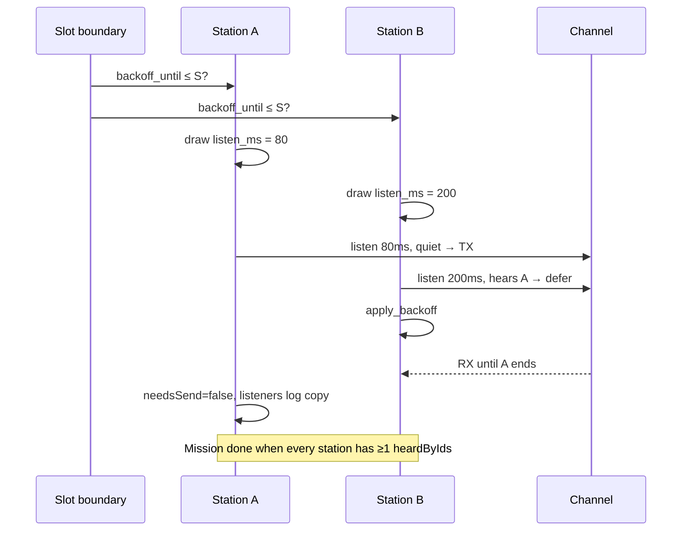

# Transmission Queue

How Ribbit's contest transmission queue works — the scheduling model, operator states, and what the queue visualizations show.

For the full design specification (open questions, production app integration, ACK wire format), see [contest_queue_algorithm.md](contest_queue_algorithm.md). For contest mode UX and the geographic simulator, see [contesting_mode.md](contesting_mode.md).

---

## What the queue does

In contest mode, many independent stations share one SSB frequency. Overlapping transmissions collide destructively — there is no RF-layer recovery. Each station keeps a **local outbound queue** and uses a **GPS-slotted p-persistent CSMA** algorithm to decide when to transmit.

Goals:

1. **Throughput** — deliver as many messages as possible per unit time
2. **Low collisions** — overlapping transmissions should be rare
3. **No starvation** — avoid everyone listening and nobody transmitting
4. **Fairness** — no single station monopolizes the channel
5. **No coordinator** — stations only learn from what they hear on the air

---

## Time model

All nodes share UTC time at **2-second resolution** (same grid as the Ribbit message header timestamp). A **slot** is one 2-second interval aligned to even UTC seconds.

```
UTC:  … │ :00 │ :02 │ :04 │ :06 │ :08 │ …
         └─────┴─────┴─────┴─────┴─────┘
           S0    S1    S2    S3    S4
```

| Constant | Value | Meaning |
|----------|-------|---------|
| `SLOT_MS` | 2000 | Slot duration; decision boundary every 2 s |
| `TX_MS` | ~2350 | On-air composite burst (~2.35 s: 200 ms VOX + 100 ms silence + 2.048 s waveform) |
| `T_MIN` / `T_MAX` | 50 / 400 ms | Random carrier-sense listen window inside a slot |
| `MAX_BACKOFF_EXP` | 4 | Caps exponential backoff at 16 slots (32 s) |
| `SILENCE_SLOTS` | 3 | Consecutive empty windows before silence floor reschedules all queued operators |

**Contest queue simulator** (`web/contest_queue_simulator.html`) uses these same MAC defaults (adjustable TX time / timing window / TX-frames quantization for the listen window). See [Contest queue simulator](#contest-queue-simulator-webcontest_queue_simulatorhtml) under Visualizations, and the timing audit in [contest_queue_timing_audit.md](contest_queue_timing_audit.md).

**Important:** A transmission can **span the next slot boundary**. Competing stations must treat the channel as busy until the burst ends, not only until the next even-second tick.

---

## Operator states

At any moment, each station is in one of these **visual / logical** states:

| State | Badge (queue UI) | Meaning |
|-------|------------------|---------|
| **IN QUEUE** (`q`) | Amber | Has not yet been heard by a peer; eligible to contend when backoff allows |
| **LIVE** (`tx`) | Green | Won contention; transmitting |
| **RX** (`rx`) | Cyan | Another station is on the air; this station is receiving |
| **CONFIRMED** (`ok`) | Green dim | At least one peer has decoded this station's transmission |

Production queue entries also track `attempts`, `backoff_until`, and optional `in_flight` while audio plays. See [contest_queue_algorithm.md](contest_queue_algorithm.md#the-queue-structure).

---

## Algorithm (per slot boundary)

At each slot index `S` (time `S × SLOT_MS`), every station with pending traffic runs the same logic independently.

### 1. Queue check

```
if queue is empty → IDLE (passive listen)
if front entry.backoff_until > S → LISTEN (still in backoff)
else → proceed to carrier sense
```

### 2. Carrier sense (contention resolution)

Each eligible station draws a random listen duration:

```
listen_ms = uniform(T_MIN, T_MAX)   // 50–400 ms
```

After listening for `listen_ms`:

- If the channel is **busy** (another transmission detected) → **defer** and apply backoff
- If **quiet** → **transmit** (this station wins the slot)

Stations that draw shorter listen times start first and win. Stations that draw longer times hear the winner and defer.

```
t = 0 ms      Slot boundary — contenders evaluate
t = 50 ms     Station A (drew 50 ms) → quiet → starts TX
t = 120 ms    Station B (drew 120 ms) → hears A → defers
t = 310 ms    Station C (drew 310 ms) → hears A → defers
t ≈ 2400 ms   A's burst ends
t = 2000 ms   Next slot — B and C may contend again
```

In the **geographic simulator**, “channel busy” is **per listener**: a station only defers if it would **detect** the occupant (distance, transmitter PWR, listener Gain). Distant hidden nodes may still contend — see [contesting_mode.md](contesting_mode.md#carrier-sense-and-hidden-nodes).

In **`web/queue.html`**, every station hears every transmission (simplified full-mesh RX for teaching the CSMA cycle).

### 3. Transmit

The winner occupies the channel from `win_start` for `TX_MS`. Other stations that can hear it enter **RX**.

When the burst completes:

- The transmitter marks its round complete (`needsSend = false` in the simple sim)
- All listeners record the sender (decode log, contact graph, or ACK list depending on simulator)

### 4. Backoff on deferral

```
attempts += 1
backoff_slots = random(1 .. 2^min(attempts, MAX_BACKOFF_EXP))
backoff_until = current_slot + backoff_slots
```

| Attempt | Backoff window (slots) | Max wait |
|---------|----------------------|----------|
| 1 | 1–2 | 4 s |
| 2 | 1–4 | 8 s |
| 3 | 1–8 | 16 s |
| 4+ | 1–16 | 32 s |

After `attempts > 3`, the production queue promotes the message to **HIGH** priority so aging traffic cannot be starved by new entries.

### 5. Silence floor (starvation prevention)

If **no station contends** for `SILENCE_SLOTS` consecutive slots (6 s) and the local queue is non-empty:

```
backoff_until = current_slot   // force eligibility on next boundary
```

Multiple stations may unlock at once; the random listen draw still picks a single winner.

---

## Mission / completion

Simulators use different stop conditions:

| Simulator | Mission complete when |
|-----------|------------------------|
| **`web/queue.html`** | Every operator has been **heard by at least one peer** (`heardByIds.size ≥ 1` for all) |
| **`web/contest_queue_simulator.html`** | Configurable; default tracks contacts, ACKs, and geographic copy — see [contesting_mode.md](contesting_mode.md#mission-complete-condition) |

The simple queue UI mission timer stops when the last pending operator gets a green confirmation dot.

---

## Queue entry (production)

Each station's outbound queue is an ordered list:

```
MessageQueueEntry {
  message_id      // 80-bit: Callsign[48] + Timestamp[31] + Emergency[1]
  payload         // Packed bytes for WASM encoder / playback
  enqueue_time    // Slot index when enqueued
  attempts        // Failed contention count
  backoff_until   // Slot before which entry must not transmit
  in_flight       // Optional: true while audio is playing
}
```

**Priority:** HIGH if emergency or `attempts > 3`; otherwise NORMAL. FIFO within each class.

**Deduplication:** On decode, if the Message ID matches a queued outbound entry, remove it — the network already delivered that information.

---

## Visualizations

### Live queue (`web/queue.html`)

Focused operator-card view for the CSMA cycle. Open via local server, e.g. `http://localhost:8000/web/queue.html`.

**Controls**

| Control | Effect |
|---------|--------|
| Operators (2–24) | Population for reset |
| Speed (×) | Real-time multiplier for simulation clock |
| Reset & run | New random callsigns; restart mission timer |
| Pause / Resume | Freeze or continue `requestAnimationFrame` loop |
| Step | Advance 50 ms while paused |

**Header**

| Field | Source |
|-------|--------|
| Sim time | Elapsed simulation milliseconds |
| Mission | Time since reset until all confirmed (or elapsed while running) |
| Confirmed | Count with `heardByIds.size ≥ 1` / total operators |

**Status pills**

| Pill | Count |
|------|-------|
| LIVE | `isTransmitting` |
| PENDING | `heardByIds.size === 0` |
| CONFIRMED | `heardByIds.size ≥ 1` |

**Operator card fields**

| Field | Meaning |
|-------|---------|
| Confirmation dot | Square = not heard; green circle = heard by ≥1 peer |
| Badge | LIVE / RX / IN QUEUE / CONFIRMED |
| WAIT | Backoff remaining, **Ready**, or **—** if done |
| DECODES | Number of other stations this operator has copied |
| TX SLOT | Contention slot index `S{n}`, **READY**, or **—** |
| Phase bar (8 ticks) | `slot_index mod 8` — visual cycle for the station's next or current slot |
| Heard list | Callsign — name for each decoded transmission |
| Bottom segments | Progress toward peer confirmation (fills as `heardByIds` grows) |

**Sidebar counters**

| Counter | Increment |
|---------|-----------|
| Slot | `floor(simMs / SLOT_MS)` |
| TX ok | Successful burst completions |
| Deferrals | Backoff applications after losing contention |

### Contest queue simulator (`web/contest_queue_simulator.html`)

Full contest model: Maidenhead map, asymmetric PWR vs Gain propagation, ACK piggybacking, operator rotation, statistics dashboard. Scheduling matches the production-oriented MAC in [contest_queue_algorithm.md](contest_queue_algorithm.md): 2 s GPS slots, ~2.35 s composite burst, 50–400 ms carrier-sense listen window, binary exponential backoff (≤ 16 slots), 3-slot silence reset, and attempt-count aging / HIGH promotion. Documented in [contesting_mode.md](contesting_mode.md#interactive-simulator); audit record in [contest_queue_timing_audit.md](contest_queue_timing_audit.md).

#### Adjustable timing (sidebar)

| Control | Range | Default | Drives |
|---------|-------|---------|--------|
| TX time | 2–5 s (step 0.05) | **2.35 s** | On-air burst length (`txMs`); default = composite burst |
| Timing window | 1.0–4.0 s | **2.0 s** | GPS slot length (`slotMs`); independent of burst (burst may span a boundary) |
| TX frames | 10–30 | 20 | Quantization of the **50–400 ms** listen window into discrete carrier-sense frames |

#### Listen-window + backoff scheduling (simulator behavior)

When an operator is scheduled (spawn, deferral, post-TX cooldown, or silence-floor unlock), it draws a carrier-sense offset inside the current/next eligible slot:

```
listenSpanMs = LISTEN_MAX_MS − LISTEN_MIN_MS          // 350
frameStep    = listenSpanMs / txFrames
frameIndex   = random integer in [0, txFrames − 1]
baseOffset   = LISTEN_MIN_MS + frameIndex × frameStep // in [50, 400] ms
offset       = agedOffset(baseOffset, attempts)       // deferred ops floor to 0
nextTxMs     = max(simMs, backoffUntilSlot × slotMs) + offset
```

- On deferral, NORMAL priority applies **binary exponential backoff** capped at exponent 4 (≤ 16 slots); HIGH priority (emergency or `attempts > 3`) contends every slot.
- At `nextTxMs`, if the channel is clear for that listener → transmit; if busy → defer (`applyBackoff`). Contenders are ordered by earliest offset, then HIGH-before-NORMAL, then higher attempts, then older enqueue, then lower id.
- After 3 consecutive silent slots, every queued operator's backoff is cleared so someone can unlock the channel.
- Tile **Next TX** shows countdown plus frame index. Fairness instrumentation tracks peak contenders and max wait against `Bounded_Wait(N) = 14 + 2N` slots.

---

## End-to-end flow (simple sim)



---

## Production app (current)

The main Ribbit app (`web/scripts/index.js`) still encodes and plays immediately with an `isTransmitting` guard — **no outbound queue yet**. Contest scheduling will need:

- Slot-aligned evaluation on UTC 2 s grid
- Parallel carrier-sense tap while `listen === false` during local TX
- Sidetone rejection so local playback does not fake “channel busy”
- Optional IndexedDB persistence for queued entries

See [contest_queue_algorithm.md](contest_queue_algorithm.md#ribbit-application-context) for integration notes.

---

## Quick reference

| Topic | Document |
|-------|----------|
| Full algorithm spec + open questions | [contest_queue_algorithm.md](contest_queue_algorithm.md) |
| Contest mode, map/tile UI, propagation | [contesting_mode.md](contesting_mode.md) |
| Message format, timestamps, ACK layout | [codec.md](codec.md) |
| Live card simulator | `web/queue.html` |
| Geographic simulator | `web/contest_queue_simulator.html` |
