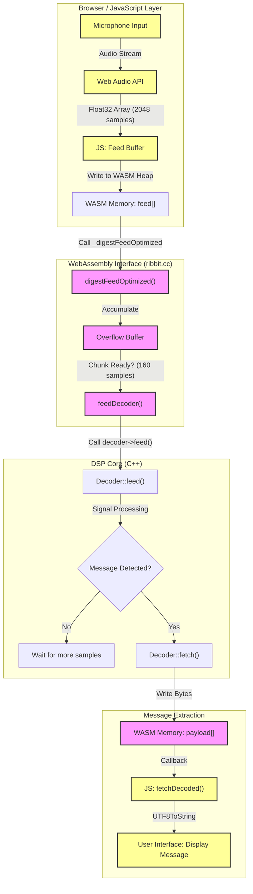

# Ribbit WebAssembly Implementation

## Overview

Ribbit uses WebAssembly (WASM) to run high-performance digital signal processing (DSP) code in web browsers. The implementation uses Emscripten to compile C++ DSP libraries into WebAssembly, providing near-native performance for audio encoding/decoding operations.

## Architecture

### Module Structure

The WebAssembly implementation consists of two files:

- **`ribbit.js`** (16KB) - Emscripten-generated JavaScript loader and runtime
- **`ribbit.wasm`** (103KB) - Compiled WebAssembly binary containing DSP algorithms

### Key Components

1. **Encoder**: Converts text messages to audio signals using phase-shift keying (PSK)
2. **Decoder**: Extracts text messages from received audio signals
3. **DSP Library**: FFT, filters, Hilbert transform, and modulation/demodulation algorithms
4. **Memory Management**: Efficient heap allocation for audio buffers

## Message ID Structure

The Ribbit protocol caches a unique 80-bit Message ID for each transmission to handle deduplication and metadata. This packaged component consists of:

| Component | Bits | Description |
|-----------|------|-------------|
| **Callsign** | 48 | Alphanumeric sender identifier (8 chars × 6 bits) |
| **Timestamp** | 31 | Unix timestamp packed with custom epoch |
| **Emergency** | 1 | High-priority flag (0 = Normal, 1 = Emergency) |
| **Total** | **80** | Unique message identifier |

This 80-bit structure is critical for the "Contest Mode" and general message handling, ensuring that repeat transmissions of the same message are identified correctly.

### Operator names (contest / packed header)

After the fixed header fields, first and last names are length-prefixed (4 bits + 4 bits) and each character is **5-bit alphabit** (32 symbols: space, `A`–`Z`, and `@` `.` `:` `/` `-`), matching `MessageCodec` in `web/scripts/messageCodec.js` and `ALPHABIT_*` in `src/ribbit/include/message_format.hh`. Letters are case-insensitive on the wire; the JS decoder applies title case. Details and examples: [codec.md](codec.md) (section *Alphabit Encoding*).

### Hex Visualization
In the Web UI, this ID is presented as a **20-character Hexadecimal string** (e.g., `4B4F36...`). This allows operators to easily visually verify message uniqueness and trace specific transmissions in logs.

### Demo & Verification

You can verify the Message ID generation and test the full message format using the **Message Format Demo**.

**Location**: `web/message_format_demo.html`

> [!IMPORTANT]
> **Local Server Required**: Due to browser security restrictions on WebAssembly and file access, you cannot open this file directly (e.g., `file://...`). You must run a local HTTP server.

**How to Run**:

1.  Open a terminal in the project root.
2.  Start a Python HTTP server:
    ```bash
    python3 -m http.server 8000
    ```
3.  Open your browser to: `http://localhost:8000/web/message_format_demo.html`

This tool allows you to:
*   Switch between **Chat Mode** and **Contest Mode**.
*   See the **80-bit Message ID** generated in real-time.
*   Compare message sizes and efficiency.
*   Verify the encoding/decoding loop using the actual WASM binary.

## Processing Flow

The following diagram illustrates how audio data flows from the browser's microphone input through the WebAssembly/Ribbit processing pipeline to decode messages.



### Key Functions & Triggers

*   **`digestFeedOptimized()`**: The main entry point for audio data. It handles the mismatch between Web Audio API buffer sizes (typically 2048 or 4096 samples) and the Ribbit decoder's internal requirement (160 samples). It buffers incoming data into an `overflow` array.
*   **`feedDecoder()`**: Automatically triggered by `digestFeedOptimized` whenever 160 samples (20ms at 8kHz) are accumulated. This ensures the DSP core receives a consistent stream of data.
*   **`Decoder::feed()`**: The core C++ signal processing function. It runs the FFT and demodulation algorithms. It returns `true` **only** when a complete message has been successfully detected and decoded.
*   **`fetchDecoded()`**: A JavaScript callback triggered immediately upon message detection. This notifies the web app to read the `payload` buffer and display the message.

## Loading the WASM Module

### Correct Loading Method

**Always use the Emscripten Module API** - never load WASM directly:

```html
<!-- Include the Emscripten-generated JavaScript -->
<script src="scripts/ribbit.js"></script>
<script src="scripts/your_app.js"></script>
```

```javascript
// your_app.js - Correct loading
let Module;

// Set up required callbacks before loading
window.encoderCreated = () => {
    console.log("Encoder initialized");
};

window.decoderCreated = () => {
    console.log("Decoder initialized");
};

// Load the module
Module().then((moduleInstance) => {
    console.log("✓ WASM module loaded successfully");
    // Now you can use the module
    moduleInstance._createEncoder();
    moduleInstance._createDecoder();
}).catch((error) => {
    console.error("✗ WASM loading failed:", error);
});
```

### Incorrect Loading Method

```javascript
// DON'T DO THIS - Direct WASM instantiation fails
const response = await fetch('./scripts/ribbit.wasm');
const wasmBinary = await response.arrayBuffer();
const result = await WebAssembly.instantiate(wasmBinary, {
    env: { /* imports */ },
    wasi_snapshot_preview1: { /* imports */ }
});
```

## API Reference

### Initialization

```javascript
// Load the module
const module = await Module();

// Create encoder and decoder
module._createEncoder();
module._destroyEncoder();  // Cleanup when done

module._createDecoder();
module._destroyDecoder();  // Cleanup when done
```

### Memory Management

```javascript
// Allocate and free memory
const ptr = module._malloc(sizeInBytes);
module._free(ptr);

// Access memory buffers
const buffer = module.HEAP8.subarray(ptr, ptr + length);
```

### Encoder API

```javascript
// Initialize encoder with message data
module._initEncoder(messagePtr, messageLength);

// Read encoded audio signal
const signalLength = module._readEncoder();
const signalPtr = module._signal_pointer();
const signalLength = module._signal_length();

// Access signal buffer
const signalBuffer = module.HEAPF32.subarray(
    signalPtr / 4,  // Float32 offset
    (signalPtr + signalLength * 4) / 4
);
```

### Decoder API

```javascript
// Feed audio data to decoder
module._feedDecoder(audioPtr, audioLength);

// Process buffered audio
const result = module._digestFeed();

// Get decoded message
const messagePtr = module._message_pointer();
const messageLength = module._message_length();
const message = module.UTF8ToString(messagePtr, messageLength);
```

### Optimized Functions

```javascript
// Use optimized digest function when available
const result = module._digestFeedOptimized();
```

### Utility Functions

```javascript
// Convert between JavaScript strings and C strings
const cStringPtr = module.stringToUTF8("Hello World");
const jsString = module.UTF8ToString(cStringPtr);
const length = module.lengthBytesUTF8("Hello World");

module._free(cStringPtr);  // Don't forget to free allocated strings
```

## Memory Layout

### Buffer Sizes

| Buffer | Size | Purpose |
|--------|------|---------|
| Feed Buffer | 2048 samples | Incoming audio chunks |
| Message Buffer | 256 bytes | Decoded text message |
| Signal Buffer | 16384 samples | Encoded audio output |
| Payload Buffer | 256 bytes | Message payload data |

### Heap Access

```javascript
// Different typed array views of the same heap
const heapU8 = module.HEAPU8;      // Uint8Array
const heapU32 = module.HEAPU32;    // Uint32Array
const heapF32 = module.HEAPF32;    // Float32Array
const heapF64 = module.HEAPF64;    // Float64Array
```

## Callback Functions

Set these global callbacks before loading the module:

```javascript
window.encoderCreated = () => {
    console.log("Encoder ready");
};

window.decoderCreated = () => {
    console.log("Decoder ready");
};
```

## Audio Processing

### Sample Rate
- **8000 Hz** - Optimized for narrowband HF radio transmission
- **Mono** - Single channel audio
- **32-bit Float** - High precision for DSP operations

### Signal Characteristics
- **Duration**: ~2.0 seconds (16384 samples at 8000 Hz)
- **Modulation**: Phase-shift keying (PSK)
- **Bandwidth**: Narrowband for HF radio constraints

### Continuous Audio Streaming

**Critical Concept**: Ribbit requires continuous audio streaming for real-time message detection. Messages can arrive at any time from other users, so your application must maintain a constant audio stream from the microphone to the decoder.

#### Web Audio API Integration

```javascript
// 1. Request microphone access
const stream = await navigator.mediaDevices.getUserMedia({
    audio: {
        echoCancellation: false,    // Important: disable for radio audio
        noiseSuppression: false,    // Important: preserve signal integrity
        autoGainControl: false,     // Important: maintain original levels
        sampleRate: 8000           // Required: Ribbit needs 8000 Hz
    }
});

// 2. Create audio context and processing chain
const audioContext = new AudioContext({ sampleRate: 8000 });
const source = audioContext.createMediaStreamSource(stream);
const processor = audioContext.createScriptProcessor(2048, 1, 1);

// 3. Set up continuous processing callback
processor.onaudioprocess = (event) => {
    const inputBuffer = event.inputBuffer;
    const audioData = inputBuffer.getChannelData(0); // Get mono channel

    // Feed this audio chunk to WASM decoder immediately
    feedAudioChunkToDecoder(audioData);

    // Check for decoded messages after each chunk
    checkForDecodedMessages();
};

// 4. Connect the audio processing chain
source.connect(processor);
processor.connect(audioContext.destination);

// The onaudioprocess callback will fire repeatedly (~43 times per second with 2048 buffer)
// providing a continuous stream of audio data to the decoder
```

#### Continuous Decoding Pattern

```javascript
function feedAudioChunkToDecoder(audioData) {
    // Allocate memory for audio chunk
    const audioPtr = module._malloc(audioData.length * 4); // Float32 = 4 bytes
    module.HEAPF32.set(audioData, audioPtr / 4);

    // Feed audio chunk to decoder
    module._feedDecoder(audioPtr, audioData.length);

    // Process any complete chunks in the decoder buffer
    const result = module._digestFeedOptimized();

    // Free the allocated memory
    module._free(audioPtr);

    // Check if a message was decoded
    if (result >= 0) {
        extractAndProcessMessage();
    }
}

// This function is called continuously as audio chunks arrive
// Messages can be detected at any time, not just at chunk boundaries
```

#### Why Continuous Streaming Matters

- **Real-time Communication**: Messages arrive asynchronously from other users
- **No Polling Required**: The decoder processes audio as it arrives
- **Low Latency**: Messages are detected within ~46ms (one audio chunk)
- **Always Listening**: The application must maintain the audio stream to receive messages

#### Buffer Management

The decoder uses internal buffers to handle audio chunks:

- **Feed Buffer**: 2048 samples (256ms at 8000 Hz) - incoming audio chunks
- **Chunk Buffer**: 160 samples (20ms) - fixed processing size
- **Overflow Buffer**: Handles partial chunks between processing calls

```javascript
// Buffer sizes (defined in ribbit.cc)
const FEED_LENGTH = 2048;    // Audio chunk size from Web Audio API
const CHUNK_LENGTH = 160;    // Fixed decoder input size
// Overflow buffer handles the difference automatically
```

#### Best Practices for Continuous Streaming

1. **Never Stop the Audio Stream**: Keep `onaudioprocess` active to receive messages
2. **Use Appropriate Buffer Sizes**: 2048-4096 samples balances latency and performance
3. **Handle Audio Context Suspension**: Resume context when user interacts
4. **Monitor Audio Levels**: Ensure radio audio is audible but not distorted
5. **Clean Up Resources**: Properly close audio contexts and streams when done

#### Audio Context Lifecycle

```javascript
// Handle audio context state changes
async function ensureAudioContextRunning() {
    if (audioContext.state === 'suspended') {
        await audioContext.resume();
    }
}

// Resume audio when user interacts with the page
document.addEventListener('click', ensureAudioContextRunning);
document.addEventListener('touchstart', ensureAudioContextRunning);
```

## Browser Compatibility

### Supported Browsers
- ✓ Chrome/Chromium 57+
- ✓ Firefox 52+
- ✓ Safari 11+
- ✓ Edge 79+

### Required Features
- WebAssembly support
- SharedArrayBuffer (for some advanced features)
- Web Audio API (for audio playback/testing)
- TypedArray support

## Troubleshooting

### Common Errors

#### "WebAssembly.instantiate(): Import #0 'a': module is not an object or function"
**Cause**: Trying to load WASM directly instead of using Emscripten Module API
**Solution**: Use `Module()` function from `ribbit.js`

#### "WASM module failed to load"
**Cause**: CORS issues or missing files
**Solution**: Use local web server, check file paths

#### "Function X not found"
**Cause**: Calling function without underscore prefix
**Solution**: All exported functions need `_` prefix: `module._createEncoder()`

#### Memory access errors
**Cause**: Accessing freed memory or buffer overflow
**Solution**: Check pointer validity and buffer sizes

### Debugging Tips

1. **Check console**: Open browser DevTools (F12) and check for errors
2. **Clear cache**: Hard refresh (Ctrl+Shift+R) to clear cached WASM files
3. **Use web server**: Never open HTML files directly (file:// protocol)
4. **Verify files**: Ensure both `ribbit.js` and `ribbit.wasm` exist in `web/scripts/`

### Performance Issues

1. **Memory growth**: Monitor heap usage with browser DevTools
2. **Function calls**: Minimize JS<->WASM boundary crossings
3. **Buffer allocation**: Reuse buffers when possible to reduce GC pressure

## Development Workflow

### Building WASM Module

1. **Prerequisites**: Install Emscripten SDK 4.0.8+
2. **Build**: Run `build.bat` (Windows) or manual emcc command
3. **Test**: Use `run_tests.sh` to start local server
4. **Debug**: Check browser console and network tab

### Adding New Functions

1. **Export in C++**: Add function declarations
2. **Update build**: Add to `EXPORTED_FUNCTIONS` in build script
3. **Rebuild**: Run build script to regenerate WASM files
4. **Test**: Verify function works in browser

### Memory Management Best Practices

1. **Always free allocated memory**: Use `_free()` for `_malloc()` calls
2. **Check buffer bounds**: Verify array access doesn't exceed allocated size
3. **Reuse buffers**: Allocate once and reuse for better performance
4. **Monitor heap**: Use browser DevTools to check memory usage

## Advanced Usage

### Direct Memory Access

```javascript
// Get pointer to internal buffer
const feedPtr = module._feed_pointer();
const feedLength = module._feed_length();

// Create view of the buffer
const feedBuffer = module.HEAPF32.subarray(
    feedPtr / 4,
    (feedPtr + feedLength * 4) / 4
);

// Modify buffer directly
feedBuffer.set(audioData);
```

### Custom Callbacks

```javascript
// Set custom callbacks
window.onProgress = (percent) => {
    console.log(`Processing: ${percent}%`);
};

window.onError = (message) => {
    console.error("DSP Error:", message);
};
```

### Integration with Web Audio

```javascript
// Create Web Audio context
const audioContext = new AudioContext({ sampleRate: 8000 });

// Get encoded signal from WASM
const signalPtr = module._signal_pointer();
const signalLength = module._signal_length();
const signalBuffer = module.HEAPF32.subarray(
    signalPtr / 4,
    (signalPtr + signalLength * 4) / 4
);

// Play the audio
const audioBuffer = audioContext.createBuffer(1, signalLength, 8000);
audioBuffer.copyFromChannel(signalBuffer, 0);

const source = audioContext.createBufferSource();
source.buffer = audioBuffer;
source.connect(audioContext.destination);
source.start();
```